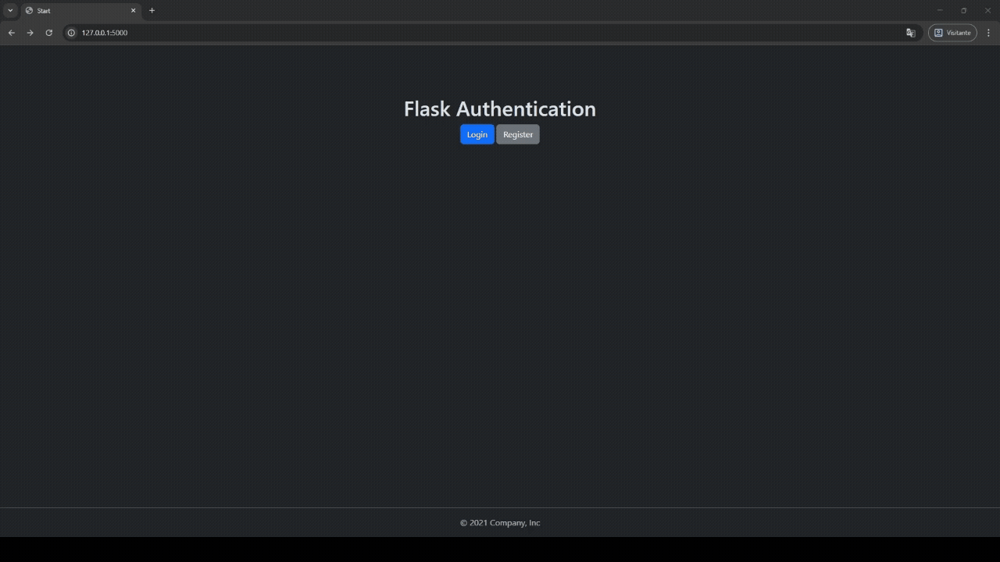

# 📚 Library on the web

This web application covers the most important
usages of flask related modules. The idea was to create 
an interactive panel that stores a user's list of books,
that displays the title, author and rating of each book. The users need to
authenticate themselves to access the application and see 
their books through a registration and login system.
One cannot see or edit other users' books.
---

---

## 🆕 Update (v2.0)
- Added user authentication (registration and login) and techniques for keeping passwords secure in the DB
- Each user now has their own private book collection, meaning they can't access or edit each other's books
- Improved database structure using SQLAlchemy relationships
- Html files inheritance from jinja2 was used to make files more organized and clean
- Flash messages in login and registration pages are displayed when users try to authenticate incorrectly

---

When the user authenticate himself, the flask application interacts with a SQLite DB, where the books
from each user are stored. The interaction between the application and the DB is done via SQLAlchemy.
The forms used for logging in, registering, adding and editing a book are validated by WTForms.
The styling used in the html files was created using Bootstrap. The passwords are securely stored in the DB 
using hash functions (SHA256 with 8-character salt).

---

# 🛠️ Technologies Used

Flask — web framework

SQLAlchemy — ORM for database operations

SQLite — lightweight database

WTForms — form handling and validation

Flask Login — for authenticating users

Werkzeug Security — keeps the passwords safe

Bootstrap — Customization and Styling 

---