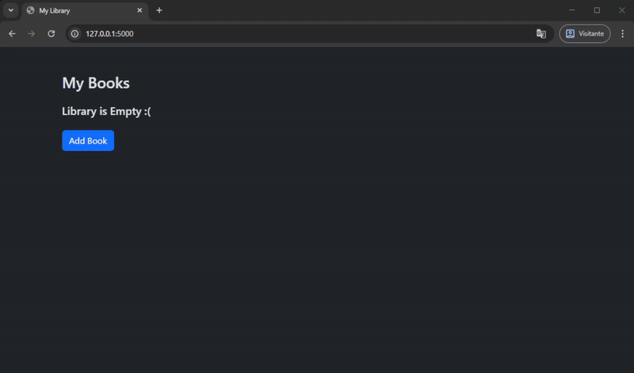

# 📚 Library on the web
This web application covers the most important
usages of flask related modules. The idea was to create 
an interactive panel that displays a list of books,
showing the title, author and rating.

Users can:

➕ Add a new book

🗑️ Delete an existing book

✏️ Edit the rating of any listed item

---

The flask application interacts with a SQLite DB, where the books
are stored, via SQLAlchemy. The forms used for the 'add' and 'edit'
options are validated by WTForms. The styling was created using Bootstrap.

---

# 🛠️ Technologies Used

Flask — web framework

SQLAlchemy — ORM for database operations

WTForms — form handling and validation

SQLite — lightweight database

Bootstrap — Customization and Styling 

---

